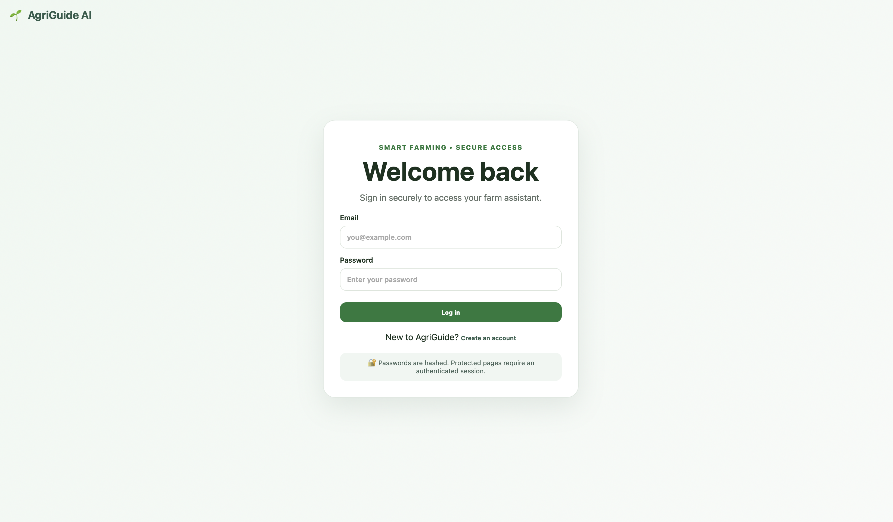

🌱 AgriGuide AI

AI-Powered Agricultural Extension & Farmer–Expert Consultation Platform

AgriGuide AI is a full-stack agricultural assistance platform designed to help farmers receive practical agricultural guidance and connect with relevant agricultural professionals.

The project combines agricultural extension concepts, artificial intelligence, web development, and cybersecurity to create a secure digital platform for farmer support.

**Project status:** Hackathon MVP / Portfolio Project

---

🎯 Project Overview

Farmers may struggle to quickly access reliable agricultural information or identify the right professional to consult when facing crop, livestock, poultry, fishery, or soil-related problems.

AgriGuide AI addresses this by providing:

- 🌾 Agricultural question-and-answer assistance
- 🧠 AI-assisted agricultural guidance
- 👨‍🌾 Farmer authentication
- 👩‍🌾 Agricultural professional recommendations
- 💬 Farmer–professional consultation requests
- 📋 Consultation history
- 🖼️ Agricultural image assessment
- ⚠️ Agricultural risk assessment
- 🔐 Security controls for protecting users and application endpoints

---

✨ Key Features

👨‍🌾 Farmer Features

- Account registration and login
- Secure session management
- Agricultural Q&A
- Risk assessment
- Image-based agricultural assessment
- Expert recommendation
- Consultation requests
- Personal consultation history
- Professional response notifications

👨‍🔬 Professional Features

- Professional authentication
- Role-based authorization
- Professional dashboard
- View incoming farmer consultation requests
- Respond to farmer requests
- Specialty-based matching

🧠 Intelligent Professional Recommendation

AgriGuide analyzes the farmer's question and identifies the most relevant agricultural specialty.

Examples:

Farmer Question| Recommended Specialty
Tomato leaves are turning yellow| Agronomist
My chickens are coughing| Poultry Specialist
My fish are dying| Aquaculture Specialist
My goats are sick| Veterinarian
My soil is poor| Soil Specialist
General agricultural question| Agricultural Extension Officer

The recommendation system uses weighted agricultural keywords and specialty matching to determine the most relevant professional category.

---

🔐 Cybersecurity Features

Security was treated as an important part of the application rather than an afterthought.

Implemented controls include:

- Password hashing with Werkzeug
- Secure server-side sessions
- HTTP-only cookies
- SameSite cookie protection
- CSRF protection
- Login attempt throttling / temporary lockout
- Role-based access control
- Server-side ownership validation
- Protected API endpoints
- Input validation and limits
- Prompt-injection filtering
- High-risk input detection
- Audit logging
- Security response headers
- Content Security Policy
- X-Content-Type-Options
- X-Frame-Options
- Referrer-Policy
- Path traversal protection
- Sensitive file exposure checks

---

🛡️ Security Testing

The application was tested locally against:

http://127.0.0.1:5000

Testing included:

- Authentication bypass checks
- Authorization checks
- CSRF testing
- SQL injection probes
- XSS probes
- Prompt-injection testing
- Path traversal testing
- Sensitive file exposure testing
- HTTP method testing
- Security header verification
- Protected API endpoint testing

Example Results

Test| Result
Unauthenticated API access| Blocked
Unauthorized professional access| Blocked
Missing CSRF token| Blocked
SQL injection probe| Blocked by authentication controls
XSS probe| Blocked by authentication controls
Path traversal| Blocked
Sensitive file access| Blocked
TRACE request| Rejected
Security headers| Present

Testing was performed against the local development application and should not be interpreted as a production security assessment.

---

🏗️ Technology Stack

Backend

- Python
- Flask
- SQLite
- Werkzeug

Frontend

- HTML5
- CSS3
- JavaScript

Security

- Session-based authentication
- CSRF protection
- Password hashing
- Role-based authorization
- Security headers
- Input validation
- Audit logging

Development

- Git
- GitHub
- macOS
- Python virtual environment

---

📂 Project Structure

agriguide-ai/
│
├── app.py
├── knowledge_base.json
├── requirements.txt
├── .env.example
├── .gitignore
├── LICENSE
├── README.md
│
└── static/
    ├── app.js
    ├── index.html
    └── style.css

Local development backup files are intentionally excluded from version control.

---

🚀 Running the Application Locally

1. Clone the repository

git clone https://github.com/Raheemolaitan/agriguide-ai.git
cd agriguide-ai

2. Create a virtual environment

python3 -m venv .venv

3. Activate the environment

source .venv/bin/activate

4. Install dependencies

pip install -r requirements.txt

5. Configure environment variables

Create a ".env" file based on:

.env.example

Never commit real secrets or credentials to GitHub.

6. Start the application

python app.py

Open:

http://127.0.0.1:5000

---

🧪 Basic Application Test

After starting the application:

1. Create a farmer account.
2. Log in.
3. Submit an agricultural question.
4. Test the risk assessment feature.
5. Test image assessment.
6. Request an expert recommendation.
7. Submit a consultation request.
8. Open My Requests.
9. Log in as a professional.
10. Open the professional dashboard.
11. Respond to a consultation.
12. Return to the farmer account and verify the response.

---

🔎 Project Architecture

                 ┌──────────────────────┐
                 │      Farmer/User      │
                 └──────────┬───────────┘
                            │
                            ▼
                 ┌──────────────────────┐
                 │   AgriGuide Frontend │
                 │   HTML/CSS/JavaScript│
                 └──────────┬───────────┘
                            │
                            ▼
                 ┌──────────────────────┐
                 │      Flask API       │
                 │ Authentication       │
                 │ Authorization        │
                 │ CSRF Protection      │
                 │ Validation           │
                 └──────────┬───────────┘
                            │
             ┌──────────────┼──────────────┐
             ▼              ▼              ▼
       ┌───────────┐ ┌────────────┐ ┌──────────────┐
       │ AI / Q&A  │ │ Expert     │ │ Consultation │
       │ Guidance  │ │ Matching   │ │ Workflow     │
       └───────────┘ └────────────┘ └──────────────┘
                            │
                            ▼
                    ┌──────────────┐
                    │    SQLite    │
                    │   Database   │
                    └──────────────┘

---

🔒 Production Security Considerations

AgriGuide AI is currently a development/hackathon MVP.

Before production deployment, additional controls should include:

- HTTPS/TLS
- Production WSGI server
- Strong production secret management
- Persistent rate limiting
- Secure account recovery
- Email verification
- Multi-factor authentication
- Verified professional accounts
- Production-grade database configuration
- Centralized logging and monitoring
- Security testing and code review
- Secure deployment infrastructure

---

🌍 Potential Impact

AgriGuide AI demonstrates how digital technologies can support agricultural extension services by helping farmers:

- Access agricultural information more quickly
- Identify appropriate professional expertise
- Document agricultural problems
- Request professional assistance
- Maintain consultation history

The project also demonstrates the integration of agricultural extension, software engineering, AI-assisted decision support, and cybersecurity in a single application.

---

👨‍💻 Project Author

Raheem Olaitan Abdulrasheed

Agricultural Extension & Communication Technology
Federal University of Technology, Akure

Areas Demonstrated

- Agricultural Extension
- Python Development
- Flask
- Web Application Security
- Cybersecurity
- AI-assisted application development
- Networking and security testing
- Git/GitHub

---

📌 Project Status

Current status: Functional MVP / Portfolio Project

The application has undergone functional testing and local security testing. Further development is required before production deployment.

---

📄 License

This project is licensed under the MIT License. See the "LICENSE" file for details.k
